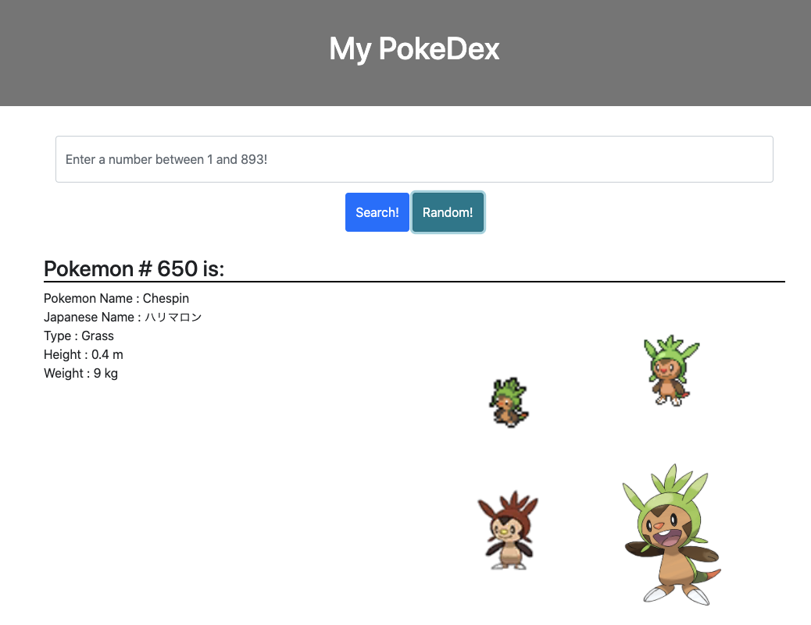

# personalProject-PokeDex

This is an application with the PokeDex feature. Fully mobile responsive powered by Bootstrap, this PokeDex will ouput the Pokemon information by the Pokemon Number he/she has provided. It provides English/Japanese names of the Pokemon, height, weight and the type(s). The application also provides images of official, shiny, dream world, front and Generation VIII where available. 

Equipped with the Random button, the user can randomly generate the number and view the Pokemon of that number. 

# Tech used

- HTML
- CSS
- jQuery
- JavaScript
- Boostrap
- Poke API (https://pokeapi.co/)

# User Story

As an Pokemon fan,
I WOULD like to see the pokemon information by the number

# Deployment

https://noriyuki-ishii-820.github.io/personalProject-PokeDex/

# License

MIT
